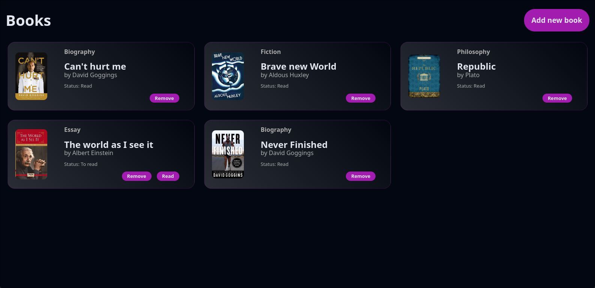

# Book Library Project

This project allows users to manage a virtual library of books. The library is represented as an array of book objects, and users can interact with the library by adding new books, removing existing ones, and updating the read status of each book.

## Project Setup

The project is set up with skeleton HTML, CSS, and JS files. The book objects are stored in an array called `myLibrary`. The code includes a `Book` constructor and a function `addBookToLibrary` that takes user input and adds new book objects to the library array.

```javascript
const myLibrary = [];

function Book(title, author, pages, read) {
  // Book constructor...
}

```
### Displaying Books
A function loops through the library array and displays each book on the page. The books can be displayed in a table or individual cards.

### Adding New Books
A "NEW BOOK" button is provided, which, when clicked, brings up a form allowing users to input details for a new book, including title, author, pages, and read status. The form submission is handled to prevent the default behavior and update the library with the new book.

### Removing Books
Each displayed book includes a button to remove it from the library. The removal is associated with the corresponding book object using data attributes.

### Updating Read Status
Each book's display includes a button to toggle its read status. A function is implemented in the Book prototype to facilitate updating a book's read status.

### Preview

#### Live Demo
(Visit the live demo to interact with the Book Library.)[https://facu18xk.github.io/odin-bookStore/]
